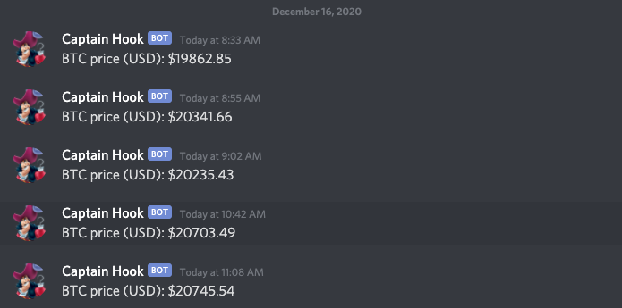

# Crypto Price Bot

### Prereqs:
1. CoinAPI API key
2. Discord Webhook
3. Docker (optional)

### Setup:
1. add coins you'd like tracked to src/bot.py (line 26)
2. Get Discord Webhook URL and paste it into config.py

### Run it locally:
Example run: `python src/bot.py YOUR-COINAPI-KEY`

### Run it via Docker:
1. Build image: `docker build -t crypto-price-bot .`
2. Run container: `docker run -e API_KEY="YOUR-COINAPI-KEY" crypto-price-bot`

### Demo
Below is an example of the Crypto Price Bot running and connected to a Discord Webhook.

