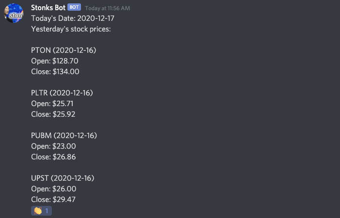

# Stock Price Bot

### Prereqs:
1. Polygon API key (lets you make up to 5 API calls per minute)
2. Discord Webhook
3. Docker (optional)

### Setup:
1. add stocks you'd like tracked to src/bot.py (line 27)
2. Get Discord Webhook URL and paste it into config.py

### Run it locally:
Example run: `python src/bot.py YOUR-API-KEY`

### Run it via Docker:
1. Build image: `docker build -t crypto-price-bot .`
2. Run container: `docker run -e API_KEY="YOUR-API-KEY" stock-price-bot`

### Demo
Below is an example of the Stock Price Bot running and connected to a Discord Webhook.

